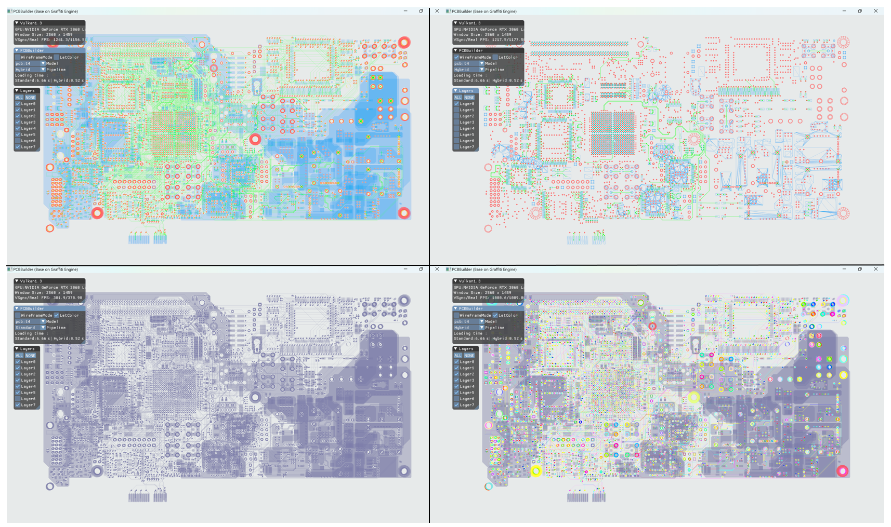
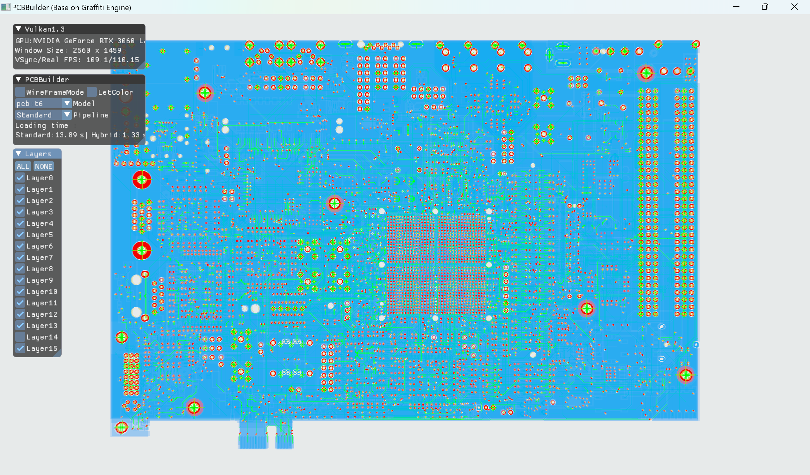
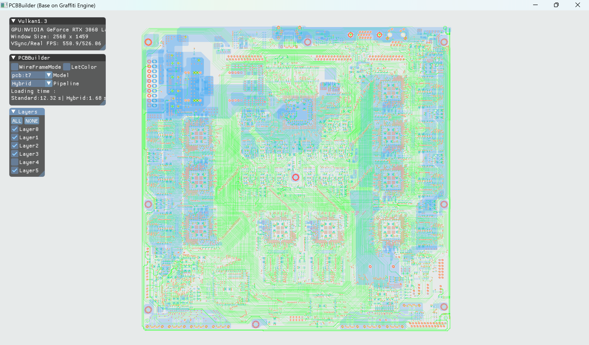

# PCBBuilder

 

###  介绍

- 面向PCB工程的混合管线建模与渲染，基于[Graffiti](https://github.com/htl309/Graffiti)引擎实现的。

- 支持OpenGL和Vulkan两个API
- 三角剖分算法没有采用GPU并行的cuda方案，只是纯的CPU方案，不过启用了C++多线程来计算。

- 下表是通用工具Allegro17.3与我们实现的混合管线和标准管线的建模时间对比(on i9/RTX 3060ti)，并且较大规模的电路板模型上我们达到了实时渲染的帧率。

| File | Allegro17.3 (s) | Standard PipeLine (s) | Hybrid PipeLine (s) |
| :--: | :-------------: | :-------------------: | :-----------------: |
|  t1  |       5.9       |         0.28          |        0.11         |
|  t2  |      20.1       |         2.01          |        0.27         |
|  t3  |      22.9       |         4.12          |        0.29         |
|  t4  |      78.4       |         6.57          |        0.51         |
|  t5  |      38.5       |         5.62          |        0.95         |
|  t6  |      91.2       |         13.89         |        1.33         |
|  t7  |      80.6       |         12.65         |        1.88         |

### 环境

- GLAD   4.6  (OpenGL API)
- Vulkan 1.3  (Vulkan API)
- GLFW          (Windows窗口)
- glm           （数学、数学、数学)
- ImGui         (交互)
- [CDT](https://github.com/artem-ogre/CDT)             (三角划分)
- [Graffiti](https://github.com/htl309/Graffiti)        (渲染引擎)
- PCB3D        (PCB的3D建模算法)

### 构建

1. 在Window系统上使用Cmake工具进行构建。项目中应该已经包含了一切，直接构建就可以运行项目。
2. **需要注意的是**，运作项目之前先双击运行一下Shader/Vulkan中的bat文件，编译一下shader。
3. 7个模型文件都包含在项目的Models文件夹下了，无需变动位置。
4. PCB3D不在Github上开源源代码了，只作为一个lib文件被链接，项目也只能在**release**模式下运行

### 预览  

- 黑色背景是OpenGL实现，白色背景是Vulkan实现。

#### t1

#### t4

#### t2

#### t3

#### t5

#### t6

#### t7

