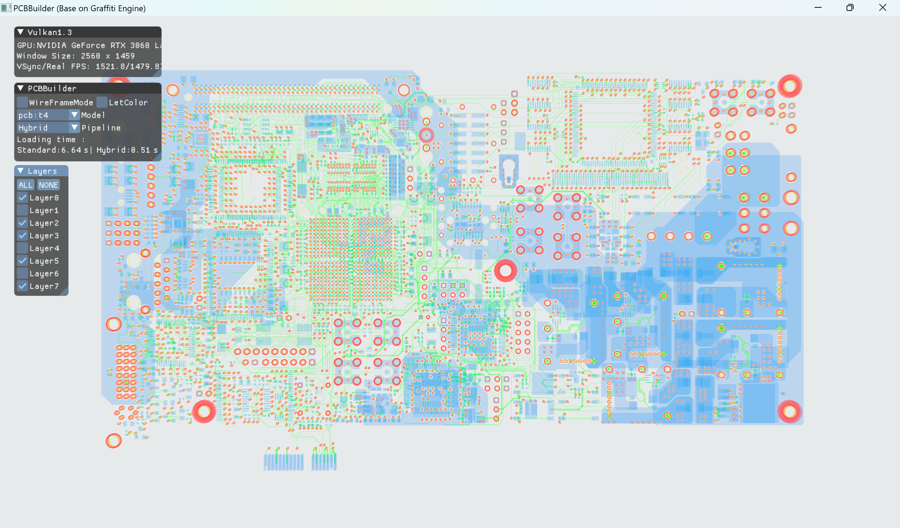
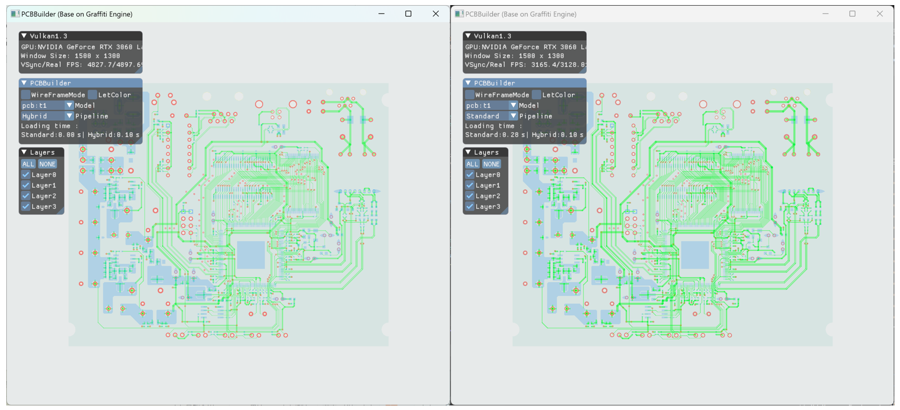
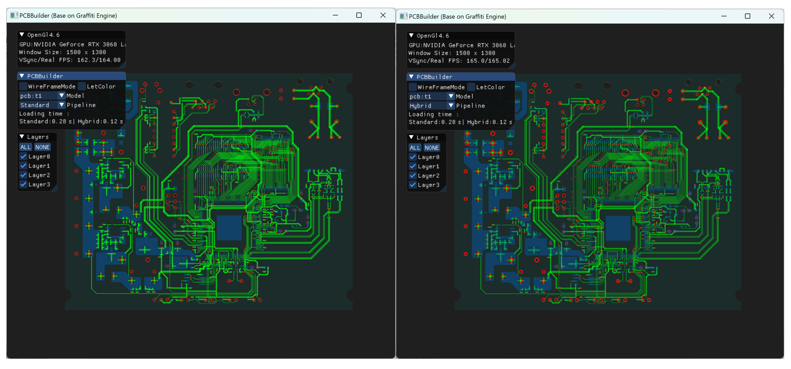
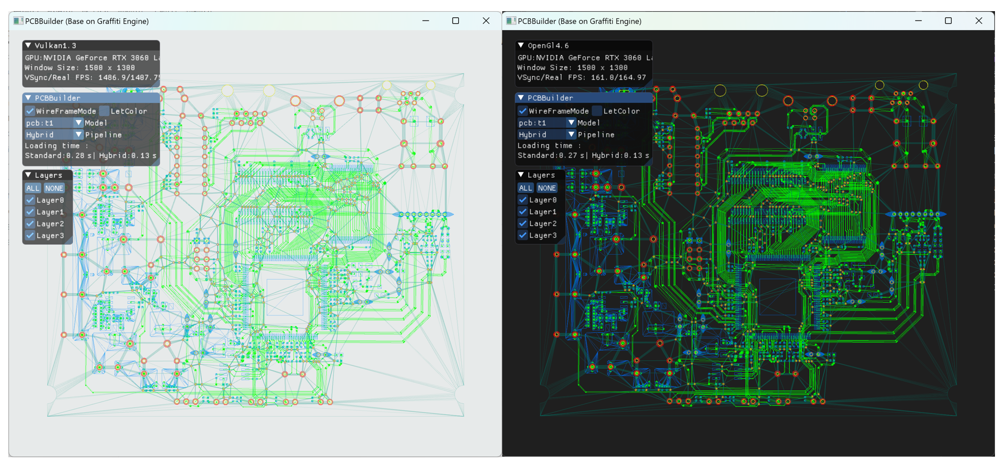
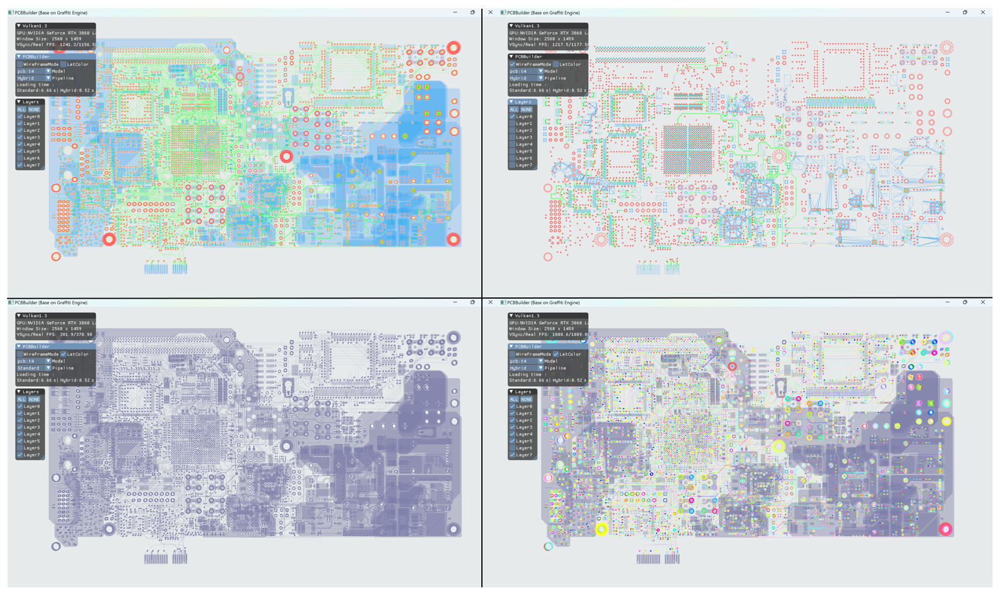
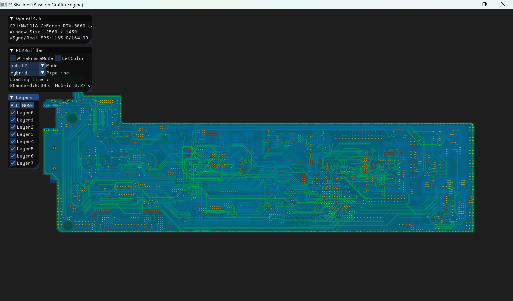
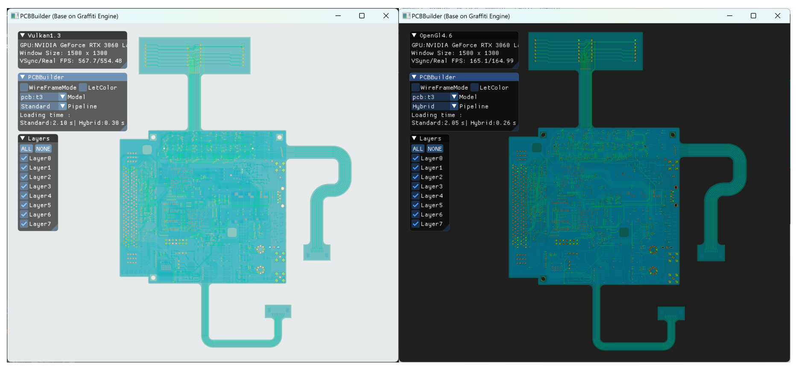
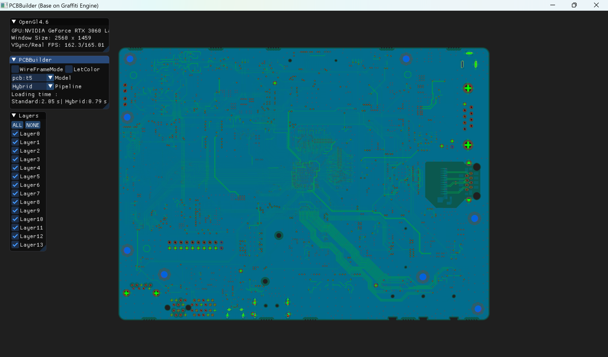
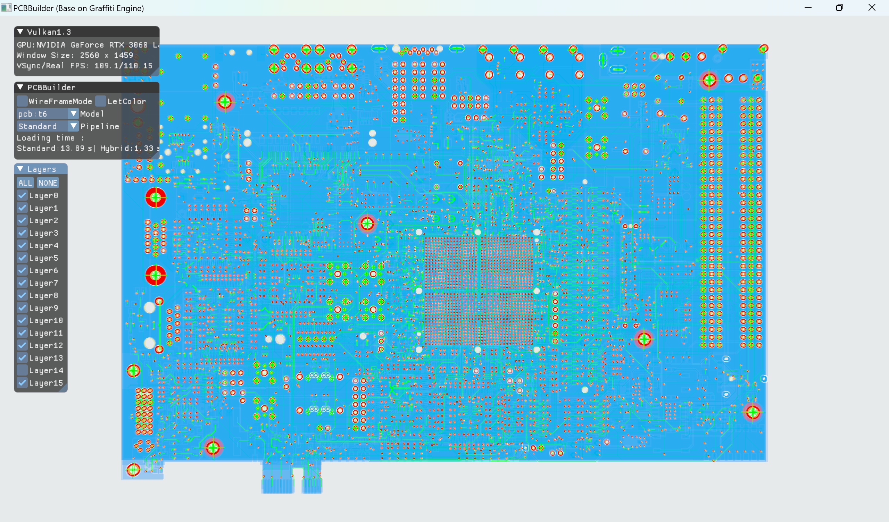
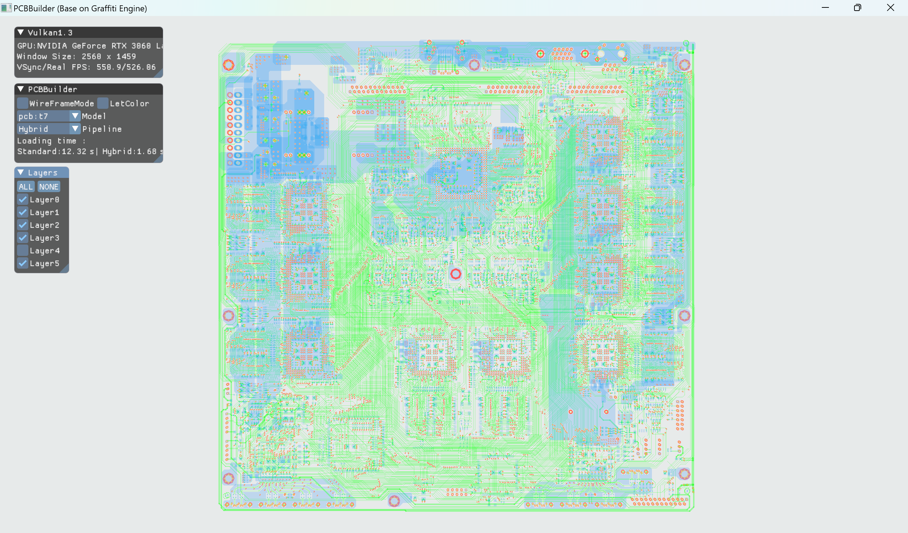

# PCBBuilder

 

### Introduction

- A hybrid pipeline modeling and rendering system tailored for PCB engineering, implemented based on the [Graffiti](https://github.com/htl309/Graffiti) Engine.
- Supports both OpenGL and Vulkan APIs.
- The triangulation algorithm does not use GPU-based CUDA parallelism; instead, it is a pure CPU solution, but utilizes C++ multithreading for computation.
- The table below compares the modeling time of the general-purpose tool Allegro 17.3 with our implemented hybrid and standard pipelines (on an i9/RTX 3060 Ti). Moreover, for larger-scale PCB models, we achieved real-time rendering frame rates.

| File | Allegro17.3 (s) | Standard PipeLine (s) | Hybrid PipeLine (s) |
| :--: | :-------------: | :-------------------: | :-----------------: |
|  t1  |       5.9       |         0.28          |        0.11         |
|  t2  |      20.1       |         2.01          |        0.27         |
|  t3  |      22.9       |         4.12          |        0.29         |
|  t4  |      78.4       |         6.57          |        0.51         |
|  t5  |      38.5       |         5.62          |        0.95         |
|  t6  |      91.2       |         13.89         |        1.33         |
|  t7  |      80.6       |         12.65         |        1.88         |

### Environment

- GLAD 4.6      (OpenGL API)
- Vulkan 1.3    (Vulkan API)
- GLFW            (Window)
- glm                (math、math、math)
- ImGui            (User interaction)
- [CDT](https://github.com/artem-ogre/CDT)               (Constrained Delaunay Triangulation)
- [Graffiti](https://github.com/htl309/Graffiti)          (Rendering engine)
- PCB3D          (3D modeling algorithms for PCBs)

### Build

1. Use CMake to build the project on Windows. Everything required should already be included in the project, so you can build and run it directly.
2. **Note: **Before running the project, make sure to double-click the `.bat` file in the `Shader/Vulkan` directory to compile the shaders.
3. The seven model files are all included in the project's *Models* folder, and no relocation is necessary.
4. PCB3D is no longer open source on GitHub; it is now provided only as a library file and linked as such. The project can only be run in **release** mode.

### Preview

- The black background represents the OpenGL implementation, while the white background represents the Vulkan implementation.

#### t1

#### t4

#### t2

#### t3

#### t5

#### t6

#### t7

